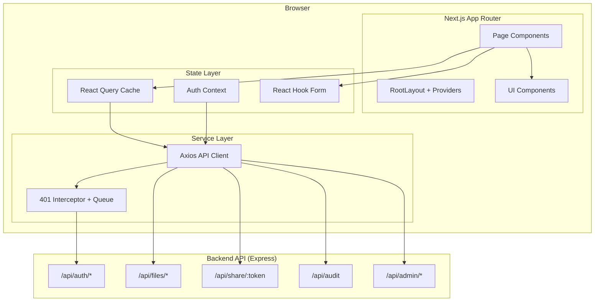
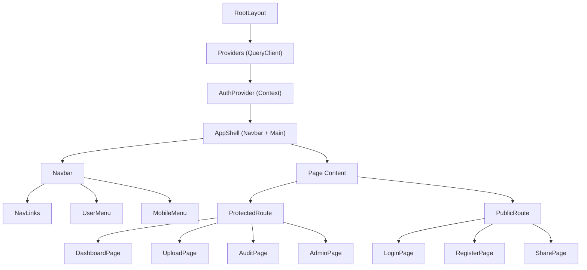

# Design Document: ShadowVault Frontend UI

## Overview

The ShadowVault frontend is a Next.js 14 application (App Router) providing a secure, dark-themed file sharing interface. It communicates with the existing Express backend via HTTP-only cookie-based authentication. The application covers the full user lifecycle: registration, login, file upload with encryption options, share link management, audit log viewing, and admin capabilities.

The frontend leverages the existing codebase structure (already scaffolded with routes, components, hooks, and an API client) and builds upon:
- **@tanstack/react-query** for server state management and caching
- **axios** with interceptors for token refresh and request queuing
- **react-hook-form + zod** for form validation mirroring backend schemas
- **TailwindCSS** with a custom dark glassmorphism theme
- **framer-motion** for page transitions and micro-interactions
- **lucide-react** for consistent iconography

Key design decisions:
1. **Cookie-based auth** — Tokens are stored in HTTP-only cookies managed by the backend; the frontend never touches raw JWTs directly.
2. **Optimistic UI** — File deletions and revocations use optimistic updates via react-query mutation callbacks for snappy UX.
3. **Shared validation schemas** — Zod schemas on the frontend mirror backend validation rules exactly, enabling instant client-side feedback.
4. **Progressive disclosure on Share page** — The share download page starts with a download button and only reveals a password field if the backend responds with `INVALID_SHARE_PASSWORD`.

## Architecture



### Routing Architecture

| Route | Component | Auth Required | Description |
|-------|-----------|---------------|-------------|
| `/` | HomePage | No | Landing/redirect |
| `/login` | LoginPage | No (redirect if authed) | Login form |
| `/register` | RegisterPage | No (redirect if authed) | Registration form |
| `/dashboard` | DashboardPage | Yes | File list |
| `/upload` | UploadPage | Yes | File upload form |
| `/audit` | AuditPage | Yes | User audit logs |
| `/admin` | AdminPage | Yes + isAdmin | Admin panel (users, audit, files) |
| `/share/:token` | SharePage | No | Public download |

### Data Flow Pattern

1. **Pages** declare data dependencies via `useQuery` hooks
2. **Mutations** invalidate relevant query keys on success
3. **Auth state** is fetched once on app mount via `GET /api/auth/me` and cached in React Query
4. **401 responses** trigger a single refresh attempt; queued requests retry after refresh
5. **Form submissions** validate client-side first (zod), then submit to the API

## Components and Interfaces

### Component Tree



### Core Interfaces

```typescript
// ─── Auth Types ──────────────────────────────────────────────────────────────

interface AuthUser {
  id: string;
  email: string;
  username: string;
  isAdmin: boolean;
  emailVerified: boolean;
  createdAt: string;
  lastLoginAt: string | null;
}

interface AuthContextValue {
  user: AuthUser | null;
  isAuthenticated: boolean;
  isLoading: boolean;
  login: (params: LoginParams) => Promise<AuthResult>;
  register: (params: RegisterParams) => Promise<AuthResult>;
  logout: () => Promise<void>;
}

interface LoginParams {
  email: string;
  password: string;
}

interface RegisterParams {
  email: string;
  username: string;
  password: string;
}

interface AuthResult {
  success: boolean;
  error?: { error: string; message: string };
}

// ─── File Types ──────────────────────────────────────────────────────────────

interface FileDashboardItem {
  fileId: string;
  originalFilename: string;
  sizeBytes: number;
  mimeType: string;
  expiresAt: string;
  downloadCount: number;
  maxDownloads: number;       // -1 = unlimited
  lastAccessedAt: string | null;
  status: 'active' | 'expired' | 'burned' | 'deleted';
  shareToken: string;
  encryptionStatus: 'encrypted';
}

interface UploadFormData {
  file: File;
  expiresInSeconds: number;
  downloadOnce: boolean;
  burnAfterReading: boolean;
  password?: string;
  maxDownloads?: number;      // -1 = unlimited
}

interface UploadResponse {
  fileId: string;
  shareUrl: string;
  shareToken: string;
  expiresAt: string;
}

// ─── Share Types ─────────────────────────────────────────────────────────────

type SharePageState = 
  | { phase: 'ready' }
  | { phase: 'password-required'; attempt?: number }
  | { phase: 'downloading' }
  | { phase: 'success'; filename: string }
  | { phase: 'error'; errorCode: string; message: string; retryable: boolean };

// ─── Audit Types ─────────────────────────────────────────────────────────────

type AuditEventType = 
  | 'UPLOAD' | 'DOWNLOAD' | 'DELETE' | 'BURN' | 'EXPIRE'
  | 'FAIL_ATTEMPT' | 'LOGIN' | 'LOGOUT' | 'PASSWORD_RESET'
  | 'LINK_CREATED' | 'LINK_REVOKED';

interface AuditLogEntry {
  id: string;
  eventType: AuditEventType;
  fileId: string | null;
  fileName: string | null;
  userId: string | null;
  ipAddress: string | null;
  userAgent: string | null;
  metadata: Record<string, unknown> | null;
  createdAt: string;
}

interface PaginatedResponse<T> {
  data: T[];
  total: number;
  page: number;
  limit: number;
}

// ─── Admin Types ─────────────────────────────────────────────────────────────

interface AdminUser {
  id: string;
  email: string;
  username: string;
  emailVerified: boolean;
  isAdmin: boolean;
  createdAt: string;
  updatedAt: string;
  lastLoginAt: string | null;
}

interface AdminAuditFilters {
  eventType?: AuditEventType;
  userId?: string;
  fileId?: string;
  startDate?: string;  // ISO 8601
  endDate?: string;    // ISO 8601
}
```

### Key Component Specifications

| Component | Props | Responsibility |
|-----------|-------|----------------|
| `AuthProvider` | `children` | Wraps app, provides auth context, handles `/auth/me` on mount |
| `ProtectedRoute` | `children`, `requireAdmin?` | Renders children only when authenticated (+ admin check); shows loader or redirects |
| `Navbar` | (from context) | Responsive nav with role-based links, mobile menu, active-route highlight |
| `DashboardPage` | — | Lists files, copy share URL, delete/revoke actions |
| `UploadPage` | — | Drag-and-drop upload form with all encryption options |
| `SharePage` | `params.token` | State-machine driven download page |
| `AuditPage` | — | Paginated audit log table with event badges |
| `AdminPage` | — | Tabbed panel: Users, Audit (with filters), File Management |
| `ConfirmDialog` | `title`, `message`, `onConfirm`, `onCancel` | Modal confirmation with focus trap |

## Data Models

### Zod Validation Schemas (Frontend)

```typescript
import { z } from 'zod';

// ─── Registration Schema ─────────────────────────────────────────────────────
export const registerSchema = z.object({
  email: z
    .string()
    .min(1, 'Email is required')
    .email('Invalid email format')
    .max(254, 'Email must not exceed 254 characters'),
  username: z
    .string()
    .min(3, 'Username must be at least 3 characters')
    .max(30, 'Username must not exceed 30 characters')
    .regex(/^[a-zA-Z0-9_]+$/, 'Username must contain only letters, numbers, and underscores'),
  password: z
    .string()
    .min(12, 'Password must be at least 12 characters')
    .max(128, 'Password must not exceed 128 characters'),
});

// ─── Login Schema ────────────────────────────────────────────────────────────
export const loginSchema = z.object({
  email: z
    .string()
    .min(1, 'Email is required')
    .email('Invalid email format')
    .max(254, 'Email must not exceed 254 characters'),
  password: z
    .string()
    .min(1, 'Password is required'),
});

// ─── Upload Schema ───────────────────────────────────────────────────────────
export const uploadSchema = z.object({
  file: z
    .instanceof(File)
    .refine((f) => f.size <= 104_857_600, 'File must not exceed 100 MB'),
  expiresInSeconds: z
    .number()
    .int()
    .min(60, 'Expiry must be at least 60 seconds')
    .max(2_592_000, 'Expiry must not exceed 30 days'),
  downloadOnce: z.boolean().default(false),
  burnAfterReading: z.boolean().default(false),
  password: z
    .string()
    .max(128, 'Password must not exceed 128 characters')
    .optional()
    .or(z.literal('')),
  maxDownloads: z
    .number()
    .int()
    .min(-1, 'Max downloads must be at least 1 or unlimited (-1)')
    .refine((v) => v === -1 || v >= 1, 'Max downloads must be 1 or greater, or unlimited')
    .optional(),
});

// ─── Share Password Schema ───────────────────────────────────────────────────
export const sharePasswordSchema = z.object({
  password: z
    .string()
    .min(1, 'Password is required'),
});
```

### React Query Key Structure

```typescript
const queryKeys = {
  auth: {
    me: ['auth', 'me'] as const,
  },
  files: {
    all: ['files'] as const,
    list: () => ['files', 'list'] as const,
    detail: (id: string) => ['files', 'detail', id] as const,
  },
  audit: {
    user: (page: number, limit: number) => ['audit', 'user', page, limit] as const,
  },
  admin: {
    users: (page: number, limit: number) => ['admin', 'users', page, limit] as const,
    audit: (page: number, filters: AdminAuditFilters) => ['admin', 'audit', page, filters] as const,
  },
};
```

### API Client Configuration

The existing `api.ts` already implements the token refresh interceptor with request queuing. The design preserves this pattern:

- **Base URL**: `NEXT_PUBLIC_API_URL/api` (defaults to `http://localhost:3001/api`)
- **Credentials**: `withCredentials: true` (sends HTTP-only cookies)
- **Refresh logic**: Single in-flight refresh, queues concurrent 401s, retries once per request
- **Timeout**: 30 seconds default (matching Requirement 13.5 network error timeout)


## Correctness Properties

*A property is a characteristic or behavior that should hold true across all valid executions of a system — essentially, a formal statement about what the system should do. Properties serve as the bridge between human-readable specifications and machine-verifiable correctness guarantees.*

### Property 1: Registration schema round-trip validation

*For any* input object, the registration Zod schema SHALL accept only inputs where: email is a valid email format with length ≤ 254, username is 3–30 characters matching `[a-zA-Z0-9_]+`, and password is 12–128 characters. All other inputs SHALL be rejected with appropriate error messages.

**Validates: Requirements 1.2, 1.3, 1.4**

### Property 2: Login schema validation

*For any* input object, the login Zod schema SHALL accept only inputs where email is a valid email format with length ≤ 254 and password is a non-empty string. All other inputs SHALL be rejected.

**Validates: Requirements 2.2**

### Property 3: Upload schema validation

*For any* input object, the upload Zod schema SHALL accept only inputs where: file size ≤ 100 MB (104,857,600 bytes), expiresInSeconds is an integer between 60 and 2,592,000 inclusive, password (if provided) is ≤ 128 characters, and maxDownloads is either -1 (unlimited) or ≥ 1. All other inputs SHALL be rejected.

**Validates: Requirements 7.12, 7.13, 7.5, 7.6**


### Property 4: Protected route redirect

*For any* route in the protected route set (Dashboard, Upload, Audit, Admin), when the user is unauthenticated, rendering that route SHALL result in a redirect to `/login`.

**Validates: Requirements 4.1**

### Property 5: Username display truncation

*For any* username string, the navigation display SHALL show the full string if its length is ≤ 20 characters, or the first 20 characters followed by an ellipsis ("…") if its length exceeds 20 characters.

**Validates: Requirements 5.3**

### Property 6: File dashboard item rendering completeness

*For any* valid `FileDashboardItem` object, the rendered dashboard row SHALL contain the original filename, expiry date, download count, max downloads (displaying "Unlimited" when value is -1), and a status badge.

**Validates: Requirements 6.2**


### Property 7: Status and event badge distinctness

*For any* valid status value in {active, expired, burned, deleted} or event type in {UPLOAD, DOWNLOAD, DELETE, BURN, EXPIRE, FAIL_ATTEMPT, LOGIN, LOGOUT, PASSWORD_RESET, LINK_CREATED, LINK_REVOKED}, the badge component SHALL render with a visually distinct style (unique color/class combination) that differs from all other values in the same set.

**Validates: Requirements 6.3, 9.5**

### Property 8: Share URL conditional display

*For any* `FileDashboardItem`, the share URL and copy-to-clipboard button SHALL be displayed if and only if the file status is "active" AND the shareToken is a non-empty string.

**Validates: Requirements 6.10**

### Property 9: Terminal share error classification

*For any* error code in the set {LINK_EXPIRED, TOKEN_REVOKED, FILE_BURNED, DOWNLOAD_LIMIT_REACHED, TOKEN_NOT_FOUND}, the Share page SHALL display an error message and SHALL NOT render a retry button. For any error that is not in this terminal set, a retry button SHALL be rendered.

**Validates: Requirements 8.7, 8.8**


### Property 10: Audit log entry rendering completeness

*For any* valid `AuditLogEntry` object, the rendered entry SHALL display the event type badge, file name (or a placeholder like "N/A" when null), timestamp formatted to the user's locale, IP address, and user agent.

**Validates: Requirements 9.2, 11.4**

### Property 11: Admin user row rendering completeness

*For any* valid `AdminUser` object, the rendered table row SHALL display the user's email, username, a role badge (distinguishing "Admin" from "User" based on the isAdmin property), creation date, and last login date (displaying "Never" when lastLoginAt is null).

**Validates: Requirements 10.4**

### Property 12: Form error clearance on correction

*For any* form field that currently displays a validation error, when the user modifies the field value to a valid value and triggers a blur event, the error message adjacent to that field SHALL be removed.

**Validates: Requirements 13.3**

## Error Handling

### Error Response Structure

The backend returns errors in a consistent format:

```json
{
  "error": "ERROR_CODE",
  "message": "Human-readable description",
  "requestId": "uuid"
}
```

### Error Display Strategy

| Context | Display Method | Duration |
|---------|---------------|----------|
| Form validation failure | Inline message adjacent to field | Until corrected |
| Backend 4xx/5xx on form submit | Toast notification OR inline below form | 5+ seconds |
| Network error (timeout/no response) | Toast notification | Until dismissed |
| Share page terminal error | Full-page error state | Persistent |
| Dashboard/Audit API failure | Inline error with retry button | Until retry |


### Error Classification

| Error Code | HTTP Status | Terminal? | User Action |
|------------|-------------|-----------|-------------|
| `AUTH_FAILED` | 401 | No | Redirect to login |
| `TOKEN_EXPIRED` | 401 | No | Auto-refresh attempt |
| `FORBIDDEN` | 403 | Yes | Display message |
| `INVALID_SHARE_PASSWORD` | 403 | No | Show password field |
| `DOWNLOAD_LIMIT_REACHED` | 403 | Yes | Display message |
| `TOKEN_NOT_FOUND` | 404 | Yes | Display message |
| `FILE_NOT_FOUND` | 404 | Yes | Display message |
| `TOKEN_REVOKED` | 410 | Yes | Display message |
| `LINK_EXPIRED` | 410 | Yes | Display message |
| `FILE_BURNED` | 410 | Yes | Display message |
| `VALIDATION_FAILED` | 422 | No | Show field errors |
| `FILE_TOO_LARGE` | 413 | No | Show size error |
| `RATE_LIMIT_EXCEEDED` | 429 | No | Show retry-after message |
| Network Error | — | No | Show connectivity message |

### Global Error Boundary

A React error boundary at the layout level catches unhandled rendering errors and displays a fallback UI with a "Reload" button. This prevents full-page crashes from propagating.

### API Client Timeout

The axios instance is configured with a 30-second timeout. If no response is received within that window, the request is rejected with a network error, and the user sees a connectivity message while form data remains preserved.

## Testing Strategy

### Testing Stack

- **Unit/Example tests**: Vitest + React Testing Library
- **Property-based tests**: fast-check (via `@fast-check/vitest` or standalone)
- **E2E tests**: Playwright (optional, for critical flows)

### Property-Based Testing Configuration

Property-based tests use `fast-check` with the following configuration:
- Minimum 100 iterations per property (`numRuns: 100`)
- Each test tagged with: `Feature: shadowvault-frontend-ui, Property {N}: {description}`
- Schemas tested in isolation (pure function tests on Zod schemas)

### Test Categories

| Category | Tool | Focus |
|----------|------|-------|
| Schema validation (Properties 1–3) | fast-check + zod | Random inputs against schemas |
| Component rendering (Properties 6, 7, 8, 10, 11) | fast-check + RTL | Random data → rendered output |
| UI logic (Properties 5, 9, 12) | fast-check + RTL | Random states → correct behavior |
| Routing (Property 4) | Vitest + RTL | Protected route behavior |
| Integration | Vitest + MSW | API mocking for mutation flows |
| Accessibility | jest-axe + RTL | ARIA compliance |


### Example-Based Tests (Key Scenarios)

- Registration flow: submit → loading state → success redirect
- Login flow: submit → error display → retry
- Dashboard: fetch files → render list → delete → optimistic removal
- Upload: select file → configure options → submit → show share URL
- Share page: load → download → password-required transition → success
- Audit: load → paginate → empty state
- Admin: users tab → audit tab with filters → file deletion with confirm

### Test File Organization

```
frontend/
├── src/
│   ├── __tests__/
│   │   ├── schemas/
│   │   │   ├── register.property.test.ts
│   │   │   ├── login.property.test.ts
│   │   │   └── upload.property.test.ts
│   │   ├── components/
│   │   │   ├── Navbar.test.tsx
│   │   │   ├── DashboardItem.property.test.tsx
│   │   │   ├── StatusBadge.property.test.tsx
│   │   │   ├── AuditEntry.property.test.tsx
│   │   │   └── SharePage.property.test.tsx
│   │   ├── hooks/
│   │   │   ├── useAuth.test.ts
│   │   │   └── useFiles.test.ts
│   │   └── routing/
│   │       └── ProtectedRoute.property.test.tsx
```

### Dev Dependencies Required

```json
{
  "vitest": "^1.4.0",
  "@testing-library/react": "^14.2.0",
  "@testing-library/jest-dom": "^6.4.0",
  "@testing-library/user-event": "^14.5.0",
  "fast-check": "^3.16.0",
  "msw": "^2.2.0",
  "jsdom": "^24.0.0"
}
```
